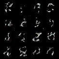

# pytorch-ddpm

Simple [Denoising Diffusion Probabilistic Models (DDPM)](https://arxiv.org/abs/2010.02502) implementation in PyTorch.

The base implementation is taken from: https://github.com/cloneofsimo/minDiffusion.

Modifications that I have made on top includes
* class bias
* positional encoding
* residual connection to the model

In order to generate diffusion model for mnist, simply run
```
$ python train_mnist.py
```

sample MNIST outputs are available [here](./Nov-23-12-45)



prediction: 6, 1, 3, 3, 1, 1, 1, 1, 6, 5, 0, 8, 4, 3, 8, 7

Please note that `train_celelba.py` and `train_cifar10.py` are not yet working